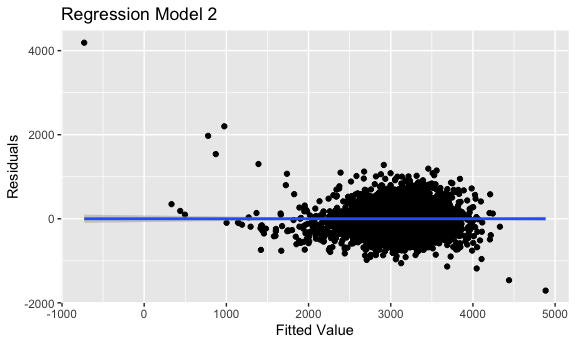

p8105\_hw6\_ac4964
================
AnMei Chen
11/26/2021

``` r
library(tidyverse)
```

    ## ── Attaching packages ─────────────────────────────────────── tidyverse 1.3.1 ──

    ## ✓ ggplot2 3.3.5     ✓ purrr   0.3.4
    ## ✓ tibble  3.1.5     ✓ dplyr   1.0.7
    ## ✓ tidyr   1.1.3     ✓ stringr 1.4.0
    ## ✓ readr   2.0.1     ✓ forcats 0.5.1

    ## ── Conflicts ────────────────────────────────────────── tidyverse_conflicts() ──
    ## x dplyr::filter() masks stats::filter()
    ## x dplyr::lag()    masks stats::lag()

``` r
library(modelr)
library(mgcv)
```

    ## Loading required package: nlme

    ## 
    ## Attaching package: 'nlme'

    ## The following object is masked from 'package:dplyr':
    ## 
    ##     collapse

    ## This is mgcv 1.8-38. For overview type 'help("mgcv-package")'.

``` r
knitr::opts_chunk$set(
  fig.width = 6,
  fig.asp = .6,
  out.width = "90%"
)

options(
  ggplot2.continuous.colour = "viridis" , 
  ggplot2.continuous.fill = "viridis"
)

scale_colour_discrete = scale_colour_viridis_d
scale_fill_discrete = scale_fill_viridis_d
```

## Problem 1

Load and clean the data for regression analysis

``` r
birthweight_df = 
  read_csv("data/birthweight.csv") %>% 
  janitor::clean_names() %>% 
  mutate(
    babysex = recode(babysex, "1" = "male", "2" = "female"),
    frace = recode(frace, "1" = "White", "2" = "Black", "3" = "Asian", "4" = "Puerto Rican", "8" = "Other", "9" = "Unknown"),
    malform = recode(malform, "0" = "absent", "1" = "present"),
    mrace = recode(mrace,"1" = "White", "2" = "Black", "3" = "Asian", "4" = "Puerto Rican", "8" = "Other", "9" = "Unknown")
  ) %>% 
  mutate(
    babysex = factor(babysex),
    frace = factor(frace),
    malform = factor(malform),
    mrace = factor(mrace)
    )
```

    ## Rows: 4342 Columns: 20

    ## ── Column specification ────────────────────────────────────────────────────────
    ## Delimiter: ","
    ## dbl (20): babysex, bhead, blength, bwt, delwt, fincome, frace, gaweeks, malf...

    ## 
    ## ℹ Use `spec()` to retrieve the full column specification for this data.
    ## ℹ Specify the column types or set `show_col_types = FALSE` to quiet this message.

``` r
check_birthweight_na = sum(is.na(birthweight_df))
check_birthweight_na
```

    ## [1] 0

Propose a regression model for birthweight. This model may be based on a
hypothesized structure for the factors that underly birthweight, on a
data-driven model-building process, or a combination of the two.

Since mother’s age and weight, as well as the gestational age in weeks
might affect baby’s health, it is possible that these factors might
influence baby’s weight.In regression model 1, I will be analyzing the
effects of these factors on birthweight.

``` r
fit_1 = lm(bwt ~ momage + gaweeks + delwt, data = birthweight_df)
summary(fit_1)
```

    ## 
    ## Call:
    ## lm(formula = bwt ~ momage + gaweeks + delwt, data = birthweight_df)
    ## 
    ## Residuals:
    ##      Min       1Q   Median       3Q      Max 
    ## -1767.61  -284.30     4.69   290.50  1610.74 
    ## 
    ## Coefficients:
    ##              Estimate Std. Error t value Pr(>|t|)    
    ## (Intercept) -275.6856    95.1635  -2.897  0.00379 ** 
    ## momage         9.9957     1.7716   5.642 1.79e-08 ***
    ## gaweeks       60.7630     2.1888  27.761  < 2e-16 ***
    ## delwt          5.4374     0.3097  17.555  < 2e-16 ***
    ## ---
    ## Signif. codes:  0 '***' 0.001 '**' 0.01 '*' 0.05 '.' 0.1 ' ' 1
    ## 
    ## Residual standard error: 448.9 on 4338 degrees of freedom
    ## Multiple R-squared:  0.2324, Adjusted R-squared:  0.2319 
    ## F-statistic: 437.8 on 3 and 4338 DF,  p-value: < 2.2e-16

``` r
summary(fit_1)$coef
```

    ##                Estimate Std. Error   t value      Pr(>|t|)
    ## (Intercept) -275.685619 95.1635113 -2.896968  3.786742e-03
    ## momage         9.995664  1.7715814  5.642227  1.785536e-08
    ## gaweeks       60.762974  2.1888103 27.760731 2.863596e-156
    ## delwt          5.437370  0.3097389 17.554691  1.055270e-66

``` r
fit_1 %>% 
  broom::tidy() %>% 
  select(term,estimate,p.value) %>% 
  knitr::kable(digits = 3)
```

| term        | estimate | p.value |
|:------------|---------:|--------:|
| (Intercept) | -275.686 |   0.004 |
| momage      |    9.996 |   0.000 |
| gaweeks     |   60.763 |   0.000 |
| delwt       |    5.437 |   0.000 |

``` r
birthweight_df %>% 
  modelr::add_residuals(fit_1) %>%
  modelr::add_predictions(fit_1) %>%  
  ggplot(aes(x = pred, y = resid)) +
  geom_point() +
  geom_smooth(method = "lm") +
  labs(
    title = "Regression Model 1",
    x = "Fitted Value",
    y = "residuals",
  )
```

    ## `geom_smooth()` using formula 'y ~ x'


Regression model using length at birth and gestational age as predictors
(main effects only)

``` r
birthweight_df %>% 
  ggplot(aes(x = blength, y = bwt)) +
  geom_point()
```


``` r
fit_2 = lm(bwt ~ blength + gaweeks, data = birthweight_df)
summary(fit_2)
```

    ## 
    ## Call:
    ## lm(formula = bwt ~ blength + gaweeks, data = birthweight_df)
    ## 
    ## Residuals:
    ##     Min      1Q  Median      3Q     Max 
    ## -1709.6  -215.4   -11.4   208.2  4188.8 
    ## 
    ## Coefficients:
    ##              Estimate Std. Error t value Pr(>|t|)    
    ## (Intercept) -4347.667     97.958  -44.38   <2e-16 ***
    ## blength       128.556      1.990   64.60   <2e-16 ***
    ## gaweeks        27.047      1.718   15.74   <2e-16 ***
    ## ---
    ## Signif. codes:  0 '***' 0.001 '**' 0.01 '*' 0.05 '.' 0.1 ' ' 1
    ## 
    ## Residual standard error: 333.2 on 4339 degrees of freedom
    ## Multiple R-squared:  0.5769, Adjusted R-squared:  0.5767 
    ## F-statistic:  2958 on 2 and 4339 DF,  p-value: < 2.2e-16

``` r
summary(fit_2)$coef
```

    ##                Estimate Std. Error   t value     Pr(>|t|)
    ## (Intercept) -4347.66707  97.958360 -44.38281 0.000000e+00
    ## blength       128.55569   1.989891  64.60439 0.000000e+00
    ## gaweeks        27.04673   1.717930  15.74379 2.358891e-54

``` r
fit_2 %>% 
  broom::tidy() %>% 
  select(term,estimate,p.value) %>% 
  knitr::kable(digits = 3)
```

| term        |  estimate | p.value |
|:------------|----------:|--------:|
| (Intercept) | -4347.667 |       0 |
| blength     |   128.556 |       0 |
| gaweeks     |    27.047 |       0 |

``` r
birthweight_df = modelr::add_residuals(birthweight_df, fit_2)

birthweight_df %>% 
  modelr::add_residuals(fit_2) %>%
  modelr::add_predictions(fit_2) %>%  
  ggplot(aes(x = pred, y = resid)) +
  geom_point() +
  geom_smooth(method = "lm") +
  labs(
    title = "Regression Model 2",
    x = "Fitted Value",
    y = "Residuals",
  )
```

    ## `geom_smooth()` using formula 'y ~ x'



Regression model using head circumference, length, sex, and all
interactions (including the three-way interaction) between these.

``` r
fit_3 = lm(bwt ~ bhead * blength + bhead * babysex + babysex *blength, data = birthweight_df) 
summary(fit_3)
```

    ## 
    ## Call:
    ## lm(formula = bwt ~ bhead * blength + bhead * babysex + babysex * 
    ##     blength, data = birthweight_df)
    ## 
    ## Residuals:
    ##     Min      1Q  Median      3Q     Max 
    ## -1133.8  -189.7    -7.2   178.8  2721.8 
    ## 
    ## Coefficients:
    ##                       Estimate Std. Error t value Pr(>|t|)    
    ## (Intercept)         -3508.3263   820.5298  -4.276 1.95e-05 ***
    ## bhead                  66.8435    25.4407   2.627  0.00863 ** 
    ## blength                35.7217    17.4013   2.053  0.04015 *  
    ## babysexmale          -259.9785   197.9105  -1.314  0.18904    
    ## bhead:blength           1.5608     0.5269   2.962  0.00307 ** 
    ## bhead:babysexmale      12.6620     7.0450   1.797  0.07236 .  
    ## blength:babysexmale    -4.2107     4.1691  -1.010  0.31257    
    ## ---
    ## Signif. codes:  0 '***' 0.001 '**' 0.01 '*' 0.05 '.' 0.1 ' ' 1
    ## 
    ## Residual standard error: 288.1 on 4335 degrees of freedom
    ## Multiple R-squared:  0.6839, Adjusted R-squared:  0.6835 
    ## F-statistic:  1563 on 6 and 4335 DF,  p-value: < 2.2e-16

``` r
summary(fit_3)$coef
```

    ##                         Estimate  Std. Error   t value     Pr(>|t|)
    ## (Intercept)         -3508.326285 820.5297576 -4.275684 1.946502e-05
    ## bhead                  66.843528  25.4406856  2.627426 8.633651e-03
    ## blength                35.721672  17.4012981  2.052816 4.015028e-02
    ## babysexmale          -259.978460 197.9104553 -1.313617 1.890448e-01
    ## bhead:blength           1.560806   0.5269054  2.962213 3.070956e-03
    ## bhead:babysexmale      12.662006   7.0449983  1.797304 7.235688e-02
    ## blength:babysexmale    -4.210673   4.1691123 -1.009969 3.125666e-01

``` r
fit_3 %>% 
  broom::tidy() %>% 
  select(term,estimate,p.value) %>% 
  knitr::kable(digits = 3)
```

| term                |  estimate | p.value |
|:--------------------|----------:|--------:|
| (Intercept)         | -3508.326 |   0.000 |
| bhead               |    66.844 |   0.009 |
| blength             |    35.722 |   0.040 |
| babysexmale         |  -259.978 |   0.189 |
| bhead:blength       |     1.561 |   0.003 |
| bhead:babysexmale   |    12.662 |   0.072 |
| blength:babysexmale |    -4.211 |   0.313 |

``` r
birthweight_df %>% 
  modelr::add_residuals(fit_3) %>%
  modelr::add_predictions(fit_3) %>%  
  ggplot(aes(x = pred, y = resid)) +
  geom_point() +
  geom_smooth(method = "lm") +
  labs(
    title = "Regression Model 3",
    x = "Fitted Value",
    y = "Residuals",
  )
```

    ## `geom_smooth()` using formula 'y ~ x'


Compare your model to two others in terms of the cross-validated
prediction error.

``` r
cv_df = crossv_mc(birthweight_df,100)

cv_df = 
  cv_df %>% 
  mutate(
    mod_1 = map(.x = train, ~lm(bwt ~ momage + gaweeks + delwt, data = .x)),
    mod_2 = map(.x = train, ~lm(bwt ~ blength + gaweeks, data = .x)),
    mod_3 = map(.x = train, ~lm(bwt ~ bhead * blength + bhead * babysex + babysex *blength, data = .x))
  ) %>% 
  mutate(
    rmse_1 = map2_dbl(.x = mod_1, .y = test, ~rmse(model = .x, data = .y)),
    rmse_2 = map2_dbl(.x = mod_2, .y = test, ~rmse(model = .x, data = .y)),
    rmse_3 = map2_dbl(.x = mod_3, .y = test, ~rmse(model = .x, data = .y))
  )

cv_df %>% 
  select(starts_with("rmse")) %>% 
  pivot_longer(
    everything(),
    names_to = "model",
    values_to = "rmse",
    names_prefix = "rmse_"
  ) %>% 
  ggplot(aes(x = model, y = rmse)) +
  geom_violin() +
  labs(
    title = "Comparison of the three Regression Models",
    x = "Models",
    y = "Cross-validated Prediction Error(RMSE)",
  )
```


## Problem 2

For this problem, we’ll use the 2017 Central Park weather data that
we’ve seen elsewhere. The code chunk below (adapted from the course
website) will download these data.

``` r
weather_df = 
  rnoaa::meteo_pull_monitors(
    c("USW00094728"),
    var = c("PRCP", "TMIN", "TMAX"), 
    date_min = "2017-01-01",
    date_max = "2017-12-31") %>%
  mutate(
    name = recode(id, USW00094728 = "CentralPark_NY"),
    tmin = tmin / 10,
    tmax = tmax / 10) %>%
  select(name, id, everything())
```

    ## Registered S3 method overwritten by 'hoardr':
    ##   method           from
    ##   print.cache_info httr

    ## using cached file: ~/Library/Caches/R/noaa_ghcnd/USW00094728.dly

    ## date created (size, mb): 2021-10-05 10:31:26 (7.602)

    ## file min/max dates: 1869-01-01 / 2021-10-31

Use 5000 bootstrap samples and, for each bootstrap sample, produce
estimates of these two quantities. Plot the distribution of your
estimates, and describe these in words.

Both the distribution plot of log(B0\*B1) and r^2 looks like they are
normally distributed.

``` r
weather_bootstrap_df =
  weather_df %>% 
  modelr::bootstrap(n = 5000)

weather_bootstrap_map_results =
  weather_bootstrap_df %>% 
  mutate(
    models = map(strap, ~ lm(tmax ~ tmin, data = .x)),
    r_squared_results = map(models, broom::glance),
    parameter_results = map(models, broom::tidy)
      ) 

log_parameter_results =
  weather_bootstrap_map_results %>% 
  select(parameter_results) %>% 
  unnest(parameter_results) %>%
  mutate(
    term = recode(term, `(Intercept)` = "intercept")
  ) %>% 
  select(term, estimate) %>% 
  pivot_wider(
    names_from = term,
    values_from = estimate
    ) %>% 
  unnest(c(intercept,tmin)) %>% 
  mutate(
    log_B0_B1 = log(intercept * tmin),
  ) 
```

    ## Warning: Values are not uniquely identified; output will contain list-cols.
    ## * Use `values_fn = list` to suppress this warning.
    ## * Use `values_fn = length` to identify where the duplicates arise
    ## * Use `values_fn = {summary_fun}` to summarise duplicates

``` r
log_parameter_results %>% 
  ggplot(aes(x = log_B0_B1)) +
  geom_density() +
  labs(
    title = " Distribution plot of log(B0*B1) ",
    x = "Desity",
    y = "log(B0*B1)",
  )
```


``` r
r_squared_results =
  weather_bootstrap_map_results %>% 
  select(r_squared_results) %>% 
  unnest(r_squared_results) %>%   
  select(r.squared)


r_squared_results %>% 
  ggplot(aes(x = r.squared)) +
  geom_density() +
  labs(
    title = "Distribution plot of r squared ",
    x = "Desity",
    y = "r squared",
  )
```


Using the 5000 bootstrap estimates, identify the 2.5% and 97.5%
quantiles to provide a 95% confidence interval for r^2 and log(B0\*B1)

``` r
log_parameter_quantiles = quantile(log_parameter_results$log_B0_B1, c(0.025,0.975)) 
log_parameter_quantiles
```

    ##     2.5%    97.5% 
    ## 1.965210 2.058056

``` r
log_parameter_ci = diff(log_parameter_quantiles) 
log_parameter_ci[[1]]
```

    ## [1] 0.09284545

``` r
r_squared_quantiles = quantile(r_squared_results$r.squared, c(0.025,0.975))
r_squared_quantiles
```

    ##      2.5%     97.5% 
    ## 0.8940581 0.9267573

``` r
r_squared_ci = diff(r_squared_quantiles) 
r_squared_ci[[1]]
```

    ## [1] 0.03269925
