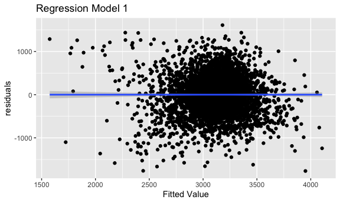

p8105\_hw6\_ac4964
================
AnMei Chen
11/26/2021

``` r
library(tidyverse)
```

    ## ── Attaching packages ─────────────────────────────────────── tidyverse 1.3.1 ──

    ## ✓ ggplot2 3.3.5     ✓ purrr   0.3.4
    ## ✓ tibble  3.1.5     ✓ dplyr   1.0.7
    ## ✓ tidyr   1.1.3     ✓ stringr 1.4.0
    ## ✓ readr   2.0.1     ✓ forcats 0.5.1

    ## ── Conflicts ────────────────────────────────────────── tidyverse_conflicts() ──
    ## x dplyr::filter() masks stats::filter()
    ## x dplyr::lag()    masks stats::lag()

``` r
knitr::opts_chunk$set(
  fig.width = 6,
  fig.asp = .6,
  out.width = "90%"
)

options(
  ggplot2.continuous.colour = "viridis" , 
  ggplot2.continuous.fill = "viridis"
)

scale_colour_discrete = scale_colour_viridis_d
scale_fill_discrete = scale_fill_viridis_d
```

## Problem 1

Load and clean the data for regression analysis

``` r
birthweight_df = 
  read_csv("data/birthweight.csv") %>% 
  janitor::clean_names() %>% 
  mutate(
    babysex = recode(babysex, "1" = "male", "2" = "female"),
    frace = recode(frace, "1" = "White", "2" = "Black", "3" = "Asian", "4" = "Puerto Rican", "8" = "Other", "9" = "Unknown"),
    malform = recode(malform, "0" = "absent", "1" = "present"),
    mrace = recode(mrace,"1" = "White", "2" = "Black", "3" = "Asian", "4" = "Puerto Rican", "8" = "Other", "9" = "Unknown")
  ) %>% 
  mutate(
    babysex = factor(babysex),
    frace = factor(frace),
    malform = factor(malform),
    mrace = factor(mrace)
    )
```

    ## Rows: 4342 Columns: 20

    ## ── Column specification ────────────────────────────────────────────────────────
    ## Delimiter: ","
    ## dbl (20): babysex, bhead, blength, bwt, delwt, fincome, frace, gaweeks, malf...

    ## 
    ## ℹ Use `spec()` to retrieve the full column specification for this data.
    ## ℹ Specify the column types or set `show_col_types = FALSE` to quiet this message.

``` r
check_birthweight_na = sum(is.na(birthweight_df))
check_birthweight_na
```

    ## [1] 0

Propose a regression model for birthweight. This model may be based on a
hypothesized structure for the factors that underly birthweight, on a
data-driven model-building process, or a combination of the two.

``` r
birthweight_df %>% 
  ggplot(aes(x = momage, y = bwt)) +
  geom_point()
```



``` r
fit = lm(bwt ~ momage + mrace, data = birthweight_df)
summary(fit)
```

    ## 
    ## Call:
    ## lm(formula = bwt ~ momage + mrace, data = birthweight_df)
    ## 
    ## Residuals:
    ##      Min       1Q   Median       3Q      Max 
    ## -2422.32  -269.79    17.96   313.78  1561.94 
    ## 
    ## Coefficients:
    ##                   Estimate Std. Error t value Pr(>|t|)    
    ## (Intercept)       3014.913     90.943  33.152   <2e-16 ***
    ## momage               4.939      2.056   2.403   0.0163 *  
    ## mraceBlack        -157.762     76.530  -2.061   0.0393 *  
    ## mracePuerto Rican  -57.503     81.624  -0.704   0.4812    
    ## mraceWhite         145.221     75.648   1.920   0.0550 .  
    ## ---
    ## Signif. codes:  0 '***' 0.001 '**' 0.01 '*' 0.05 '.' 0.1 ' ' 1
    ## 
    ## Residual standard error: 488.5 on 4337 degrees of freedom
    ## Multiple R-squared:  0.09095,    Adjusted R-squared:  0.09011 
    ## F-statistic: 108.5 on 4 and 4337 DF,  p-value: < 2.2e-16

``` r
fit %>% 
  broom::tidy() %>% 
  select(term,estimate,p.value) %>% 
  knitr::kable(digits = 3)
```

| term              | estimate | p.value |
|:------------------|---------:|--------:|
| (Intercept)       | 3014.913 |   0.000 |
| momage            |    4.939 |   0.016 |
| mraceBlack        | -157.762 |   0.039 |
| mracePuerto Rican |  -57.503 |   0.481 |
| mraceWhite        |  145.221 |   0.055 |

``` r
modelr::add_residuals(birthweight_df, fit) %>% 
  ggplot(aes(x = momage, y = resid)) +
  geom_point()
```


``` r
modelr::add_residuals(birthweight_df, fit) %>% 
  ggplot(aes(x = resid)) +
  geom_density()
```


``` r
birthweight_df = 
  birthweight_df %>% 
  mutate(
    under_30 = as.numeric(momage < 30)
  )

logistic_fit = 
  glm(
    under_30 ~ bwt + mrace, 
    data = birthweight_df, 
    family = binomial()
    )

logistic_fit %>% 
  broom::tidy() %>% 
  select(term, OR = estimate, p.value)
```

    ## # A tibble: 5 × 3
    ##   term                     OR p.value
    ##   <chr>                 <dbl>   <dbl>
    ## 1 (Intercept)       2.54      0.00288
    ## 2 bwt               0.0000164 0.933  
    ## 3 mraceBlack        1.39      0.0254 
    ## 4 mracePuerto Rican 1.27      0.0895 
    ## 5 mraceWhite        0.726     0.234

``` r
logic =
  birthweight_df %>% 
  modelr::add_predictions(logistic_fit) %>% 
  mutate(pred = boot::inv.logit(pred)) 
```
